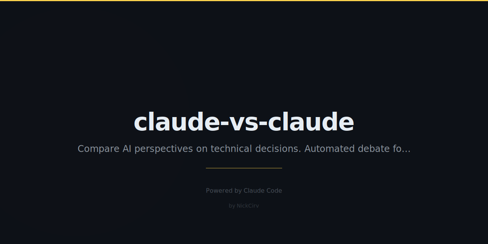

# claude-vs-claude

> Two AIs debate. You decide.

Can't decide between two approaches? Let two AI architects argue it out. A neutral judge synthesizes the best decision.

## Quick Start

```bash
npx claude-vs-claude "Should we use GraphQL or REST for our new API?"
npx claude-vs-claude "Microservices or monolith for a 5-person startup?"
npx claude-vs-claude "PostgreSQL or MongoDB for our e-commerce platform?"
```

## How It Works

1. You pose a technical question
2. **Advocate A** argues passionately for one side
3. **Advocate B** argues passionately for the other
4. **The Judge** synthesizes a decision document

All three are Claude instances with different system prompts. The debate is real, the arguments are technical, and the verdict is actionable.

## Multi-Round Debates

```bash
npx claude-vs-claude --rounds 3 "React vs Svelte for our dashboard?"
```

Round 1: Initial arguments. Round 2: Rebuttals. Round 3: Final statements. Then the verdict.

## Save Decisions

```bash
npx claude-vs-claude --save decision.md "SQL vs NoSQL?"
```

Saves the full debate + verdict as a markdown document. Perfect for ADRs.

## Example Debates

- "Should we use TypeScript or stay with JavaScript?"
- "Server-side rendering or client-side SPA?"
- "AWS Lambda or traditional server?"
- "Tailwind CSS or CSS Modules?"
- "Jest or Vitest for testing?"

## Requirements

- Node.js 18+
- `ANTHROPIC_API_KEY` environment variable

```bash
export ANTHROPIC_API_KEY=your_key_here
```

## Related

- [repo-whisperer](https://github.com/NickCirv/repo-whisperer) — Talk to any codebase
- [ai-code-roast](https://github.com/NickCirv/ai-code-roast) — Brutal code reviews

## License

MIT — NickCirv
